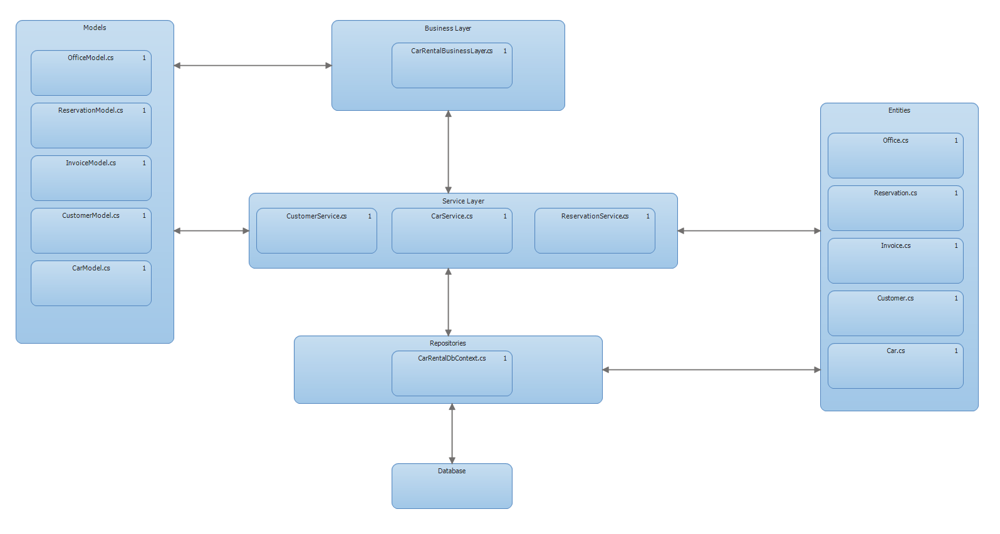

# Car Rental Kata

## Mission

This Kata helps you:
* Exercise refactoring
* Exercise Clean Code, Design and [SOLID](https://en.wikipedia.org/wiki/SOLID_(object-oriented_design)) principles
* Exercise [TDD](https://en.wikipedia.org/wiki/Test-driven_development), [Unit-](https://en.wikipedia.org/wiki/Unit_testing) and [Integration Tests](https://www.youtube.com/watch?v=vqAaMVoKz1c)
* Exercise [Repository Pattern][RepositoryPattern]

## Description

There is a existing application prototype for car rental developed by independent software developer. But the developer has moved on to new adventures and now it is your turn. One of you colleague point you to class [CarRentalBusinessLayer][CarRentalBusinessLayer] as there seems to be several issues.

There are some business rules you need to know.

### Pricing

|Car Category|Price per Day|
|:-:|:-:|
|A|50 €|
|B|65 €|
|C|90 €|
|D|120 €|

### Customer Discounts

Customer Type|Car Category|Discount|
|:-:|:-:|:-:|
|Consumer Premium|A|2 %|
|Consumer Premium|B|3 %|
|Consumer Premium|C|5 %|
|Consumer Premium|D|6 %|
|Business|C|6 %|
|Business|D|8 %|
|Business Premium|C|4 %|
|Business Premium|C|8 %|
|Business Premium|D|12 %|

## Architecture and Design

The solution utilise the [Repository Pattern][RepositoryPattern].



## Exercise(s)

1. Find and discuss all of the issues you find at the [CarRentalBusinessLayer][CarRentalBusinessLayer].

2. Refactor the method ```FindAvailableCarsForRental``` with regard to the issues you found.  **Back up you changes with unit tests**.

[CarRentalBusinessLayer]:CarRental.BusinessLayer/CarRentalBusinessLayer.cs
[RepositoryPattern]:https://msdn.microsoft.com/en-us/library/ff649690.aspx
